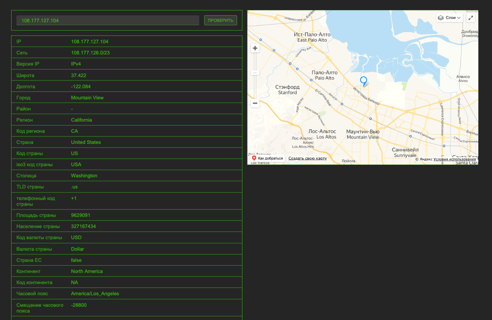

# IP Check

---

## React, Typescript, Vite, react-yandex-maps

---

## Available Scripts

- npm run dev
- npm run build
- npm run lint
- npm run preview

---

## Приложение просмотра информации по IP и геолокации

Приложение запрашивает информацию IP на следующих ресурсах:
- [ipapi.co](https://ipapi.co)
- [ip-api.com](http://ip-api.com)

При пустом запросе будет отображена информация о пользователе.

Приложение отображает на карте (@pbe/react-yandex-maps) координаты по IP.
